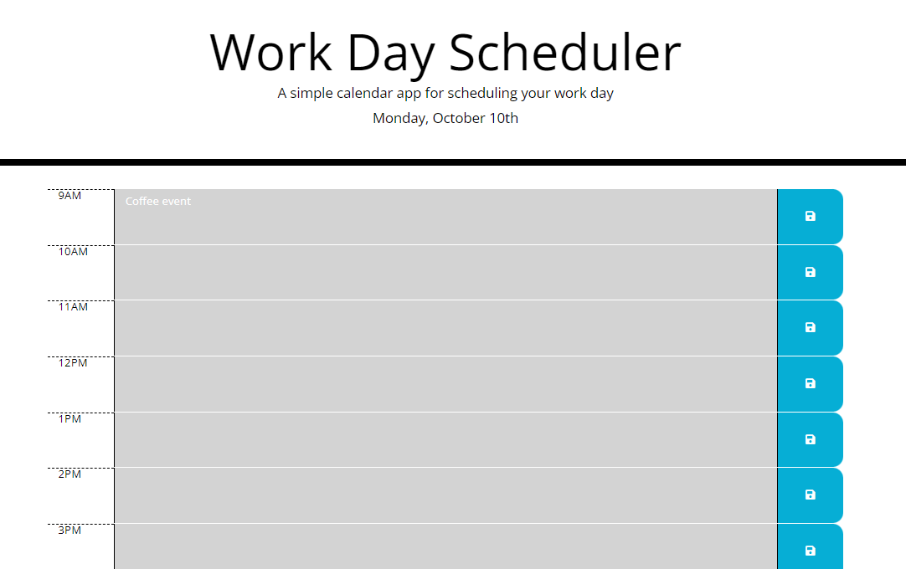

# Third-Party-API-Calender

## Description

This is the 'Module 05' challenge assignment for the UCF coding bootcamp.

Based on the starter code we were given, we were tasked with utilizing a third-party API to retrieve information on the date and time. We then make a dynamic calender out of this that'll allow us to save event dates.

## Installation

1. Copy the SSH URL
2. Open a terminal, navigate to the path where you want to open the code, and then enter into the terminal 'git clone [ssh url]'
3. ?
4. Profit

## Usage

You can install Visual Studio Code and get the 'Live Server' extension if you want to test it out in a web browser, otherwise you can just follow this [link](https://binnyboy1.github.io/Web-API-Code-Quiz/index.html).

- Typing into the hour blocks and hitting the save button on the side will save the event into storage
- Removing an event from the hour blocks and hitting save will likewise remove the event from storage
- Additionally, you will be notified whenever an event has been added or removed from storage